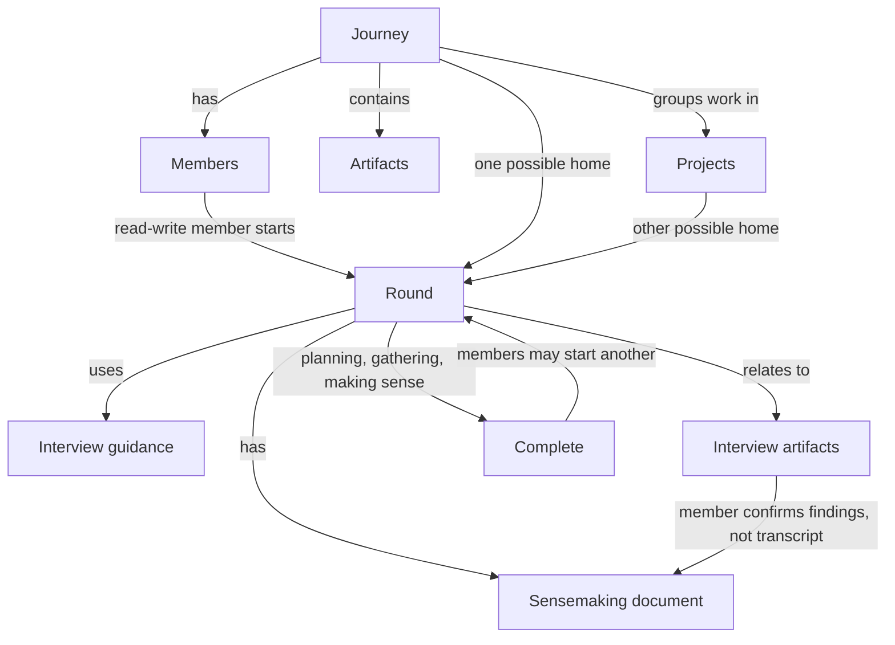

# Journey ontology

## 1. Purpose and reading guide

This draft names the app's concepts, relationships, states and access rules. It reflects [decision 0001](decisions/0001-artifacts-projects-sensemaking.md), including amendments D31–D45. Approval of this model is not approval of an implementation or a security claim.

- **Agreed** means accepted in decision 0001. `D1`–`D45` refer to its numbered decisions; amendments take precedence over earlier wording.
- **Built** means present in the cited code. It does not mean independently verified as secure.
- **Open** means unresolved. An unanswered question grants no permission.

**For Dan:** read sections 1–8. Section 8 has the one remaining product decision.

**For the build:** also read the stage-by-stage list in section 9 and the technical appendix in section 10. The appendix separates today's code from the agreed model. [The protocol](journey-protocol.md) is a format reference, but some of its account-key and compatibility guidance differs from the code.

## 2. Model overview

**Agreed:** a person creates a journey. They choose private or public visibility, a joining policy and a default member role. Guides later change its settings. Members add artifacts and group work into projects. An author may share an artifact into another journey they belong to.

A read-write member starts a sensemaking round for the journey or a project and assigns a facilitator. The round includes all journey members unless its creator selects a subset. The facilitator starts with planning. Members use interview guidance to gather material. Interviews stay private by default. The member who creates an interview artifact is its author; its subject may be someone else, and the subject can read it.

The round moves from gathering to making sense. Members confirm findings before those findings enter the shared sensemaking document. Sharing findings does not share the private interview. The facilitator moves the round to complete. They may skip, go back or reopen it. Complete ends this round, not sensemaking. Members can start another round. (D1–D7, D14–D26, D32–D38, D40–D41.)

**Built today:** people can create and join private journeys, use agents and agent links, and work with text records. Projects, private artifacts, rounds and public journeys are agreed extensions, not shipped features. See section 10.

## 3. Terms

These are the **agreed** app terms. Technical sign-in and encryption terms are defined only in the appendix. **Item** is the legacy name for artifact, used only for migration and exact code identifiers. The app does not use **owner** or **wayfinder** as roles (D7 and Naming).

### People and access

- **Account:** a person's sign-in record, separate from membership of any journey. **Built**; technical details are in section 10.1.
- **Journey:** a space for shared work. It is private or public, chosen at creation and fixed for this release. The model and storage must allow conversion later (D1, D40).
- **Member:** a participant in a journey. Its two kinds are person and agent (D7).
- **Role:** a member's content access, either read-only or read-write. Only guides change roles (D5, D33).
- **Guide:** a person member with authority to manage members and journey settings. A guide may have either content role. An authenticated member agent inherits its person's live guide authority (D45).
- **Facilitator:** an assignment to run a round, not guide authority. It draws on the [framework's facilitator practice](../../wayfinding-framework/framework/practice/guide.md). Read-write members assign facilitators when creating rounds (D7, D37).
- **Author:** the member who creates an artifact. Sharing or marking it as someone's interview document does not change its author (D38).
- **Agent:** has exactly its adding person's live capabilities, including role, guide authority, project participation and private access. Old stored access settings are accepted and ignored. It remains distinct for attribution, credentials/keys and addition/removal by its person. It has no vault; its private artifacts live in that person's vault (D45).
- **Listing:** a journey's discovery setting, not permission to read or join it. Private journeys start unlisted and may be listed to signed-in people. Public journeys may be unlisted, listed to signed-in people or listed to anyone (D2).
- **Joining policy:** one of three choices for either journey type: anyone can request and a guide approves; anyone joins immediately; or invitation only. Guides issue and cancel invites and may refuse requests. The journey sets a default role for new members (D4, D41).
- **Agent link:** a secret-bearing URL for read-only agent access. Anyone holding a live link can read through it. This is an explicit exception to private-journey encryption: the server decrypts available content while answering. Private artifacts never appear through links (D28, D31, D34).
- **Drop:** a delivery URL created by a member. Anyone with a browser, or an agent, can submit content through it. Its creator always approves inclusion into the journey. Delivery itself gives no journey access or write permission (D42).

### Content and work

- **Artifact:** the app's content entity. It has a type, free tags, versions and whole-artifact comments. Existing text categories become suggested tags through automatic migration (D8–D10).
- **Tag:** a free label attached to an artifact (D8, D10).
- **Version:** a saved revision of an artifact (D10).
- **Comment:** a response on the whole artifact. Comments on selected passages come later (D10).
- **Project:** a grouping inside one journey. It has a purpose, members and a state: getting started, active, looking for others or archived. Any journey member can join or leave. Any project member can edit its purpose and state. Agents follow their adding member's participation. Archived projects stay readable and may reopen (D16–D20, D35).
- **Private artifact:** an artifact visible to its author's person and all that person's live authenticated agents. An agent author stays the author but uses the person's vault and authority (D45). Everyone else must be unable to see even that it exists. See the single access reference in section 6 (D15 as amended by D36).
- **Sensemaking round (round):** a container for recurring [framework sensemaking](../../wayfinding-framework/framework/source/The%20AI%20Wayfinding%20Framework.md#getting-started). It has a purpose, interview guidance, a sensemaking document, contribution instructions, related artifacts, participants, facilitators and a status. It belongs to the journey or to one project. “Initial position and heading” is the round used so far (D21–D24, D37).
- **Interview guidance:** the round's script, crib notes and guidance (D22).
- **Interview:** an artifact marked as a given member's interview document for one round. It is private by default. A member's agent or a facilitator may conduct it. The facilitator may mark the relationship. The label does not transfer authorship; it gives the subject read access and nobody else (D25, D36, D38, D44). The app relationship does not redefine interviewing practice.
- **Sensemaking document:** the collaborative artifact that receives a round's shared findings, not its private transcripts (D9, D22, D26).
- **Contribution:** an addition to that document, marked with its contributor and round. The member's agent follows the contribution instructions. The member or their authenticated agent confirms each addition before it is saved. This is an action, not a separate artifact type (D26).
- **File/blob:** the uploaded file's bytes, separate from the artifact's title and other details. Private files are encrypted in the browser before upload. The limit is 25 MB per file (D11).

### Artifact types

All types below are **agreed** (D9, D39). Accepting a type string in today's records does not implement the type's behavior.

| Type | Content or behavior |
| --- | --- |
| Skill | Reusable skill material. |
| Prompt | Reusable prompt material. |
| Document | Markdown content. |
| Image | An image attachment. |
| File | Any attachment. |
| Data | JSON, CSV, SQLite, TOML, YAML and similar formats, with a data view. |
| HTML | HTML in a locked-down frame at a separate web address. Scripts run with no network or journey access (D12). |
| Applet | Browser-only code in the locked-down frame. It may read data available to its viewer, but has no network access or server code (D13, D39). |
| Link | URL, title, summary and notes. The person or agent supplies the title and summary; the server never fetches the URL. |
| Interview | Uses the interview relationship above. |
| Sensemaking document | Uses the collaborative contribution rules above. |

The arrows show relationships, not extra permissions.

## 4. Relationships: how many

All rows are **agreed**. Shared copies keep one author; sharing does not make the author a different member.

| Relationship | How many | Decision |
| --- | --- | --- |
| Journey → members | Many; at least one person guide must remain. | D7, D33 |
| Person member → agents | Zero or more; each agent has one adding person. | D6, D34 |
| Member → content role | One; guide authority and facilitator assignment are separate. | D5, D33, D37 |
| Journey → projects and rounds | Zero or more. | D16, D21 |
| Artifact copy → containing journey | One; its author may share copies into other journeys they belong to. | D14, D36 |
| Artifact copy → project | Zero or one in its containing journey. | D18 |
| Member → projects | Zero or more; agents follow their adding member. | D17, D35 |
| Artifact → versions, tags and comments | One or more versions; zero or more tags and comments. | D10 |
| Round → home | Exactly one journey or project. | D24 |
| Round → participants | All journey members by default, or a subset selected by its creator. | D37 |
| Interview → round and member it is about | One of each; neither changes its author. | D25, D38 |
| Contribution → document, contributor and round | Each addition identifies these. | D26 |
| Drop → creating member | One; this member approves inclusion. | D42 |

## 5. States and transitions

This table is the **agreed** lifecycle, not a claim that all routes exist. Recording details belong to section 9; built control entries are in section 10.3.

| Transition or action | Who acts | Rule |
| --- | --- | --- |
| Create private or public journey | Signed-in person | Select visibility, joining policy and default role. Visibility type cannot change in this release (D1, D4, D40–D41). |
| Change listing, joining or default role | Guide | Settings authority is separate from content role (D32–D33). |
| Request → admitted or refused | Applicant; guide | Applies to guide-approved joining (D41). |
| Join immediately → active | Joining person | No guide-visit delay, including for private journeys (D41). |
| Issue invite → accepted; unused invite → cancelled or expired | Guide; invitee; guide or clock | Guides control invitations (D41). |
| Add member | Guide admits person; person adds own agent | The person's live role applies; no independent agent limit (D5, D45). |
| Remove another member | Guide | Preserve the last guide; removing a person removes their agents. Agents act with their person's live removal authority (D45). |
| Remove own agent | Adding person | Allowed with either content role (D33). |
| Leave journey | Person leaving | Allowed with either role; the last guide must arrange a remaining guide first (D33). |
| Change content role | Guide | Agents follow the change, with no setting-at-addition cap (D5, D45). |
| Give or remove guide authority | Guide | Change the person's authority; their agents inherit it. Retain a person guide (D7, D45). |
| Time-limited access → expired | Clock | Access ends; already received copies cannot be recalled. **Built**; see section 10.3. |
| Agent link: created → live → expired or revoked; live/expired → renewed | Adding person; clock or removal | Read-only. Built renewal keeps the same URL; revoked links need new creation. See section 10.4. |
| Create drop or propose one through an agent link | Member; agent-link proposer | Proposal is not content inclusion (D28, D42). |
| Deliver content to drop | Anyone with its URL | No sign-in or membership is required merely to deliver (D42). |
| Approve and complete drop | Drop's creator | Review before inclusion; D5 still governs content writes. Single use, 24-hour expiry and metadata deletion remain (D29, D42). |
| Drop → expired | Clock | A delivery URL does not remain usable indefinitely (D29). |
| Join/leave project; change purpose/state; archive/reopen | Any journey member joins/leaves; project member edits | Agents follow participation. Archives remain readable (D17–D20, D35). |
| Round: planning → gathering → making sense → complete | Assigned facilitator | May skip, go back or reopen. Complete ends this round only (D23, D37). |
| Mark artifact as member's interview for a round | Facilitator | Changes its relationship, not its author. The subject gains read access (D38, D44). |
| Share artifact into another journey | Author who belongs to destination | Private stays private; non-private takes destination visibility. See section 6 (D36). |
| Add confirmed findings to sensemaking document | Member confirms; authorized writer saves | The interview itself is not shared (D26). |

## 6. Access reference

This is the single detailed reference for **agreed** permissions and visibility. Today's differences are in the appendix.

### Audiences and sharing

| Content or information | Audience | Decision |
| --- | --- | --- |
| Non-private artifact in a private journey | Journey members within their access, plus holders of deliberately created live agent links. The server normally stores encrypted content; a live link is the explicit server-readable exception. | D1, D31, D34 |
| Non-private artifact in a public journey | Anyone, even if the journey is unlisted. The server stores it readably. The journey is labelled **Public: not encrypted**. | D1, D14 |
| Private artifact in either journey type | The author's person and all that person's live authenticated agents under D45. No one else, including guides, facilitators, the server or link holders, may see its content, versions, comments, title, size, date, authorship or existence. | D36 |
| Private artifact shared into another journey | The same author-only audience. Destination membership or public visibility grants no new access. | D36 |
| Non-private artifact shared into another journey | That journey's normal audience. It is public if the destination is public. Its author is unchanged. | D36, D38 |
| Project artifact, including in an archived project | The containing journey's audience, subject to the private-artifact rule. Project artifacts stay out of the main list unless filtered for. | D18–D19, D36 |
| Listed private journey | Signed-in people see its name, short description and joining policy. These listing fields are server-readable; creation and settings warn about this. | D2 |
| Listed public journey | The chosen listing audience sees its directory entry. Listing does not change public read access. | D2 |
| Author shown on artifacts in a public journey | Set by each member's visibility: **public** shows display name and profile picture; **journeys only** shows "a member". Journey members still see the author. A private source journey is never named publicly. | D14, D36, D43 |

Sharing is between journeys the author belongs to. There is no member-to-member sharing and no named-recipient grant. An interview label is not a sharing mechanism. A facilitator who creates a private interview is its author; the member it is about can read it, and nobody else can (D36, D38, D44).

### Actions by content role

| Action | Read-write member | Read-only member | Extra authority |
| --- | --- | --- | --- |
| Read | Within the audiences above. | Same. | Guide or facilitator assignment grants no private-artifact read access. |
| Add/edit/delete ordinary artifacts; comment | Yes. | No. | Attribution is not permission. |
| Manage own profile and own agents | Yes. | Yes. | Personal controls, not ordinary content writes (D33). |
| Remove another member | Only if guide. | Only if guide. | Preserve the last person guide. |
| Leave journey | Yes. | Yes. | Preserve the last person guide. |
| Join/leave project | Yes. | Yes. | Agents follow their adding member (D35). |
| Edit project purpose/state | If a project member. | If a project member. | D17 is an explicit project-metadata exception to ordinary content writes. |
| Create round and assign facilitators | Yes. | No. | D37. |
| Move, skip, reverse or reopen round; mark interview relationship | If assigned facilitator. | If assigned facilitator. | Round-control authority is separate from the content role (D37–D38). |
| Share artifact to another journey | Author, subject to content-write authority. | No new content-write authority. | Author must belong to the destination (D5, D36). |
| Confirm contribution | Confirmation is required before saving. | Confirmation alone gives no write permission. | Saving shared findings still requires content-write authority (D5, D26). |
| Create/propose drop; deliver to its URL | Proposal and delivery are not journey writes. | Same. | Non-members may deliver; they cannot approve inclusion (D42). |
| Approve drop inclusion | Only the drop's creator. | Only the drop's creator; approval alone gives no content-write permission. | D5 and D42 must both hold; see stage 7 in section 9. |

**Additional guide actions:** change journey settings, admit people, change roles, grant/remove guide authority, issue/cancel invites and refuse join requests. A guide's own content role still governs ordinary content writes (D5, D7, D32–D33, D41).

**Agents:** every authority check evaluates the live adding person. The agent has exactly that person's capabilities, including guide and membership controls, and loses them when the person does. It signs as itself. Agent-created private artifacts are in the person's vault, readable by the person and all their live authenticated agents. Legacy agent access settings are ignored. URL agent links stay read-only and exclude private content; proposing a drop is not a direct write (D28, D31, D45).

**Applet data:** public and private applets may read any data available to the viewer, not to the applet's author. This is the explicit amendment to D12's “no journey access” rule for applets. HTML retains D12's restriction. Neither may reach the network. D13's optional small encrypted store remains journey-shared; private data must not be copied there automatically (D12–D13, D39).

## 7. Boundaries

A hostile or careless caller must not defeat these rules. **Agreed** boundaries are requirements, not built guarantees.

1. Non-members cannot obtain ordinary private content without a deliberately created live link. Removed or expired members cannot fetch new private records or keys. Previously received keys and copies cannot be recalled. Public reads need no membership; content writes still require authority (D1, D5, D31).
2. A private artifact must not leak content or existence to another member, the server, the public or an agent link. Sharing it into a public journey must not publish it (D36).
3. A hostile caller must not make an agent exceed or outlive its adding person's current capabilities, or use legacy agent settings to cap authorized actions. Removing a person removes their agents (D45).
4. A guide must not impersonate another person's profile, remove the last person guide or gain content-write permission merely through guide authority (D5, D33).
5. A private interview must not become readable beyond its author and its subject (D44), including through its label or through findings contributed to a sensemaking document. Every contribution needs the member's confirmation (D26, D36, D38).
6. A drop's delivery URL must not let its holder bypass the creator's approval, write directly to the journey or become a member (D42).
7. A link artifact must not make the server fetch its URL. HTML/applets must not use the network or execute server code. Applet data reads must not exceed the viewer's access or expose private data through a journey-shared store (D9, D12–D13, D39).
8. **Built:** pending key rotation blocks content writes and new reservations, not control-log writes. This distinction lets the remaining guide complete rotation; it is not a blanket write freeze. See section 10.3.

## 8. Decisions for Dan

None. Public attribution was settled by D43 (member visibility: public or journeys only).

## 9. For the build

The ontology comes before implementation. Workspecs stay drafts until it is approved. Each stage ships separately, in this order. These are technical questions and enforcement tasks, not requests to reopen settled product decisions.

### Stage 0 — Journey settings and member roles

- Choose records for settings, person roles and guide authority. Bind server access changes to verified authority rather than trusting plain access rows.
- Enforce D45 across every authority check. Independent agent settings must neither bypass nor cap the live adding person's capabilities.
- Allow own profiles, own-agent management and leaving for read-only people. Separate these controls from ordinary content writes and support guides with either role.
- Align core, server and browser removal paths. A non-guide must be able to remove their own agent; guide removal must work consistently. Keep last-guide and rotation rules.
- Plan new record formats across stages and enforce D30's required update for clients 0.1.3 and older in every interface. This is not an optional compatibility policy.

### Stage 1 — Artifacts and file storage

- Set type schemas, skill/prompt packaging, image formats, data-view formats and file references. Define how the 25 MB limit is measured and enforced.
- Migrate D8's eight categories to suggested tags. Map other legacy categories, including position, interview and lesson. Keep internal recovery records separate from user artifacts.
- Decide version/comment records, signed attribution, attachment counts, deletion/retention and URL validation. Today's 1 MiB JSON cap is not a file-upload service.

### Stage 2 — Projects

- Record participation so agents follow their adding member. Enforce D17's project-metadata exception without granting ordinary content writes.
- Set the initial project state and record state changes, archive and reopening. Keep zero-or-one project placement per artifact copy and main-list filtering.

### Stage 3 — Private artifacts

- Choose keys and storage that conceal content and existence from everyone outside the author audience, including the server. A shared journey key cannot provide this boundary.
- Define cross-journey copy records, stable author identity and encrypted private-copy storage. No direct recipient grants are needed. Exclude private artifacts from every agent-link response, including counts and metadata.
- Keep versions, comments, indexes and attachments within the same audience. Check both private and public destination journeys.

### Stage 4 — Sensemaking rounds

- Record home, participants, facilitator assignments, state changes and interview labels. Implement skip, reverse and reopen; marking a subject must not change author and must give only that subject read access (D44).
- Version guidance, contribution instructions and related-artifact links. Choose a safe approach to concurrent sensemaking-document edits.
- Record contributor/round attribution and durable evidence of each member confirmation. Separate author, interview subject and version writer. Enforce the content role when saving.
- Resolve the framework interview-practice citation. The linked framework has facilitator and sensemaking practice but no explicit interview reference identified by the reviews. Any framework addition is separate scope.

### Stage 5 — HTML and applets

- Choose the separate origin, frame restrictions, network controls and data-access interface. Applets must get only data available to their current viewer, never credentials or raw journey keys.
- Define the small store's limits and browser encryption. Keep the journey-shared store separate from viewer-private data. A public applet viewed by an author must not leak that author's private data to another viewer or to shared storage.
- Support data-view formats without allowing data or code to escape the frame's restrictions. Today's app page policy is not an artifact runtime.

### Stage 6 — Public journeys, listing, joining and sharing

- Design public/private storage so future conversion is possible, without offering conversion in this release.
- Implement all three joining policies for both journey types, guide-only invites, cancellation and refusal. Immediate private joining needs safe key delivery without waiting for a guide's browser; do not quietly substitute the old D3 flow.
- Implement listing warnings and audiences. Reconcile D2 with today's plaintext storage of unlisted private names and creator emails; see section 10.2.
- Set copy/provenance formats without exposing a private source journey. Keep account and member-profile details distinct from approved public-origin fields. Decide directory/API behavior for agents within D34 rather than adding an unrelated access policy.

### Stage 7 — Agent-link parity and drops

- Put overview/list/filter/search/show/comments reads in core for web, client and link. Run the client/link parity test on one journey (D27). Private artifacts must be absent from link output.
- Implement member-created drops as well as agent-link proposals. Separate URL creation/proposal, anonymous delivery, creator approval and authorized inclusion.
- Define upload handling, decline/cancel states, status after metadata deletion and checks at inclusion. Enforce single use and 24-hour expiry. Keep any retained status non-sensitive.
- Enforce D5 and D42 together: a read-only creator's approval cannot grant a content write, and another writer cannot replace that creator's approval. Specify how an approved drop waits for authorized inclusion; do not treat delivery as inclusion.

## 10. Technical appendix: built code and gaps

This appendix describes **built** behavior and known differences, not a second set of access rules. Source paths are relative to the repository root. Claims are source observations, not an independent security verification.

### 10.1 Accounts, credentials and recovery

| Technical term or record | Built behavior and source |
| --- | --- |
| Account record | Server holds email, credentials, sessions and account/member mappings. The browser stores the account name encrypted and propagates self-signed journey profiles (`packages/server/src/registry.ts`, `packages/web/src/keys.ts`, `packages/web/src/main.ts`). |
| Passkey | A WebAuthn sign-in credential. Its PRF (a passkey-derived secret) protects private keys in the browser. Each passkey seals a copy of the same person keys. The server refuses removal of the last passkey (`packages/server/src/index.ts`, `packages/server/src/registry.ts`, `packages/web/src/keys.ts`). |
| Backup code | One of eight single-use recovery secrets. Derived lookup and wrapping values let the server store a verifier hash and sealed keys. Redemption consumes the code and opens a ten-minute session limited to key retrieval, new-passkey registration and logout (`packages/web/src/keys.ts`, `packages/web/src/main.ts`, `packages/server/src/index.ts`, `packages/server/src/registry.ts`). |
| Journey key, epoch and wrap | A random 256-bit AES-GCM content key; an epoch is its numbered generation, starting at 1. A wrap encrypts it to a member's age recipient. Removal advances the epoch for remaining members; old records use old keys (`packages/core/src/teamKey.ts`, `packages/core/src/envelope.ts`, `packages/core/src/removal.ts`). |
| Journey recovery | A separate age identity and epoch-1 wrap shown once at creation. Later epochs need an encrypted export to that recipient. Core can verify/import archives; no browser journey-import flow exists. Recovery gives no guide authority or revoked membership back (`packages/web/src/main.ts`, `packages/web/src/journey.ts`, `packages/core/src/transfer.ts`, `packages/server/src/enclave.ts`). |

Fresh passkey confirmation protects credential changes, backup-code replacement, agent approval and link creation/renewal. Recovery cookies cannot use normal journey routes. Local person keys nevertheless become usable during recovery before passkey enrollment (`packages/server/src/index.ts`, `packages/web/src/main.ts`, `packages/web/src/keys.ts`).

**Protocol differences:** `docs/journey-protocol.md` describes account-specific PRF input and memory-only keys until tab-close/idle-lock. Code uses app-wide input and persistent browser keys (`packages/server/src/crypto.ts`, `packages/web/src/keys.ts`). Recovery restricts server APIs, not possession of locally decrypted keys. These discrepancies belong to separate recovery/key-persistence work, not the decisions for Dan.

### 10.2 Storage and visible metadata

| Built storage or view | What it exposes | Source |
| --- | --- | --- |
| Private records and log | Ciphertext; live agent-link handling decrypts in memory. Every keyed member can currently read ordinary records. No author-only artifact boundary exists. | `packages/core/src/envelope.ts`, `packages/web/src/journey.ts`, `packages/server/src/enclave.ts`, `packages/server/src/agentLink.ts` |
| Record envelope | Server sees existence, ID, sequence, epoch, size and date. Size is plaintext JSON bytes. This cannot be reused unchanged for D36's invisible private artifacts. | `packages/core/src/envelope.ts`, `packages/server/src/enclave.ts` |
| Journey registry | Server already stores unlisted private journey names, creator emails, account mappings, activity/count/storage. D2 presents listing as the name-disclosure step; this is a built/agreed discrepancy. | `packages/server/src/registry.ts`, `packages/server/src/index.ts` |
| Accounts and operator view | Plain account emails and membership mappings exist in storage. The operator registry API exposes journey creator email, not every account email. | `packages/server/src/registry.ts`, `packages/server/src/index.ts` |
| Member profile | Name and opt-in email are self-signed in the encrypted journey log. Email opt-in is not secrecy from the server operator's account storage. | `packages/core/src/log.ts`, `packages/web/src/main.ts` |
| Invites and agent sessions | Hashes, account links/public keys, proposed agent name/expiry and legacy ignored scopes; invite email delivery is transient. Session details are available through the session URL. | `packages/server/src/registry.ts`, `packages/server/src/index.ts`, `packages/server/src/email.ts` |

### 10.3 Signed history, authority and rotation

A **signed log** is the membership/control history. Entries contain sequence, previous-entry hash, timestamp, actor, type, body and Ed25519 signature. Clients verify the chain and permissions; unknown control types stop verification. The server stores encrypted entries and separate plain access rows rather than verified guide grants (`packages/core/src/log.ts`, `packages/web/src/journey.ts`, `packages/server/src/enclave.ts`).

| Built entry | Effect and authority in core |
| --- | --- |
| `genesis` | Creator establishes a private/sealed journey, first guide, epoch 1, minimum version, name and optional description/classification. |
| `member.add` | Guide adds person; person or their authenticated agent adds agents for that person. Agent authority inherits the live person, not separate grants. |
| `member.remove` | Guide removes another member; person may remove self or own agent. Removes a person's agents and preserves the last guide. |
| `member.rename` | Guide or adding person renames an agent. |
| `member.profile` | Person or their authenticated agent sets that person's own name and optional email. |
| `grant.add`, `grant.remove` | Guide changes a person's `members.manage`; temporary support people cannot receive it. |
| `key.rotate` | Guide advances one epoch and binds the remaining member/recipient set. |
| `client.minVersion` | Guide raises or retains the minimum client version. |

Sources: `packages/core/src/log.ts`; browser encryption and server storage: `packages/web/src/journey.ts`, `packages/server/src/enclave.ts`.

**Removal:** core and server resolve authenticated agents to their live adding person for authorization. Self-removal, own-agent removal and guide removal use that person's capabilities, independent of content role. Person removal cascades to their agents. The last person guide is preserved (`packages/core/src/membership.ts`, `packages/core/src/removal.ts`, `packages/server/src/enclave.ts`).

**Rotation:** removal sets `pendingRotation`. New `reserve` operations and `recordWrite` operations fail during this interval; content writes also require the current epoch. `logWrite` and `renew` do not have a pending-rotation block. Existing reservations cannot bypass the content-write check. Reservations are tied to their creating principal and expire (`packages/server/src/enclave.ts:50–126`).

**Role and guide authority:** content role and guide grants are independent. Authenticated agents inherit the live person's exact role and guide authority; old scopes are ignored. Temporary support people and their agents remain read-only and cannot hold guide authority. Profile and own-agent controls are independent of content role (D45; `packages/core/src/membership.ts`, `packages/server/src/enclave.ts`).

**Admission gaps:** one-use invite acceptance creates a pending request, not immediate access. A guide browser hands over keys. The browser limits issuing invites to guides, but the server accepts any read-write principal; agent email delivery is forbidden. Refusal and cancellation are not built (`packages/server/src/registry.ts`, `packages/server/src/index.ts`, `packages/web/src/journey.ts`). D41 replaces this as the complete joining model.

### 10.4 Content and interfaces

| Interface or foundation | Built behavior and agreed gap |
| --- | --- |
| Text records | Title/body, author/date/tags and optional relationships, replacement and source references. Append-only edits use `replaces`; grouping drops orphan edits. Comments attach to a version with optional reply references. `authoredBy` records human/agent/mixed writer attribution, not a separately signed artifact author. Unknown content survives parser/serializer round trips (`packages/core/src/items.ts`). |
| Web app | Accounts, private creation, invite admission, member controls, agent approval/naming/links, text list/filter/search/show/edit/versions/delete/comments and encrypted export. Reads decrypt and verify locally. Deletion hides content but retains encrypted history (`packages/web/src/main.ts`, `packages/web/src/journey.ts`). |
| Client: CLI/MCP | Approval-first connection, text add/Markdown import, list/filter/search/show/comments/status. Signed requests and encrypted writes use the approved scope. Keys may be in memory, remembered storage or a short-lived state file (`packages/client/src/cli.ts`, `packages/client/src/mcp.ts`, `packages/client/src/journey.ts`, `packages/client/src/connection.ts`, `packages/client/src/state.ts`). |
| Agent link | Paged JSON overview, current text and people; large bodies split; deleted/recovery content omitted. No search/filter/show/comments or write interface. Server verifies history and decrypts in memory. Browser expiry choices are 1, 7 or 30 days, default 7 (`packages/core/src/link.ts`, `packages/server/src/agentLink.ts`, `packages/web/src/main.ts`). |
| Link lifecycle | Expired links return 410; ended/unknown links return 404. Adding person renews after passkey confirmation using a signed remove/add pair, preserving URL with no rotation. Revocation deletes the link row (`packages/core/src/link.ts`, `packages/server/src/index.ts`, `packages/server/src/enclave.ts`). |
| Core shared reads | Core has crypto, log verification, parsing, version/comment grouping and archive import/export. Web/link share grouping; client duplicates views. Shared reads and parity tests are not built (D27; `packages/core/src/index.ts`, `packages/core/src/items.ts`, `packages/core/src/transfer.ts`, `packages/client/src/journey.ts`). |
| Files and new model | Storage holds encrypted JSON envelopes, with at most 1 MiB plaintext per record, not attachments. The new artifact types, projects, private artifacts, rounds, HTML/applet runtime, public sharing and drops are not built (`packages/server/src/index.ts`, `packages/server/src/enclave.ts`). |
| Compatibility | `CLIENT_VERSION` is still 0.1.3. Client/link reject reads below minimum; core stops on unknown control entries. Web saving has no minimum-version check. D30's required update is agreed, but its migration and consistent enforcement are not built (`packages/core/src/versions.ts`, `packages/core/src/log.ts`, `packages/client/src/journey.ts`, `packages/server/src/agentLink.ts`, `packages/web/src/journey.ts`). |

**Vocabulary mismatch:** `packages/web/src/main.ts:373` still says “Share this journey with other wayfinders”. This is built copy that conflicts with D7/Naming, not an app term endorsed by this ontology.

### 10.5 Separate backlog

Decision 0001 keeps these outside ontology approval and stages 0–7:

- Account deletion.
- Hardening: continued review of key-bound sessions, signed content records, expiry and log rollback/checkpoints. Authenticated member agents now receive all historical epoch wraps at admission, like people; URL links retain current-epoch-only delivery (D45; `packages/web/src/main.ts`, `packages/server/src/enclave.ts`). These are not new questions for Dan.
- Recovery/key-persistence and protocol-guidance discrepancies described in section 10.1.
- A second independent security review.
